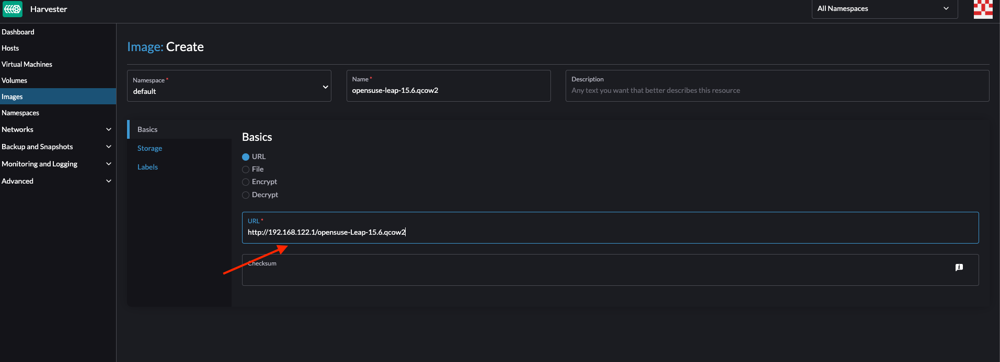
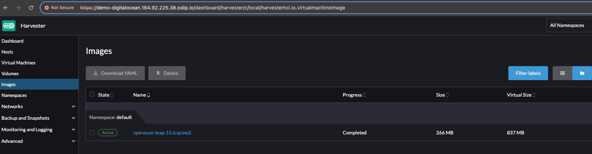
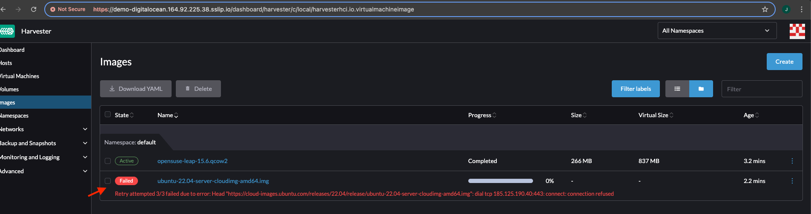
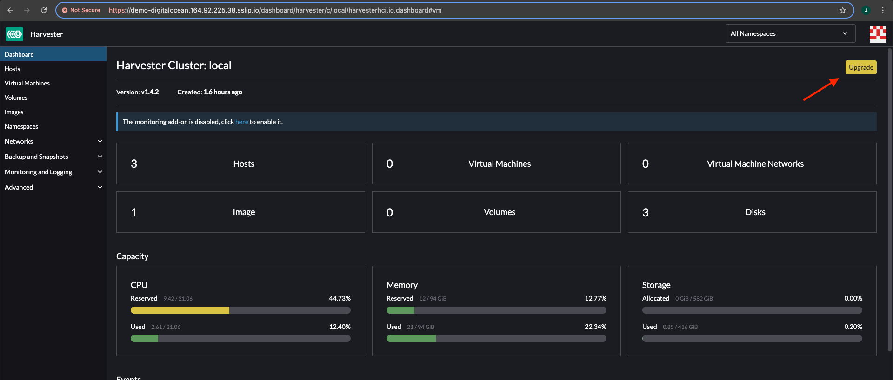
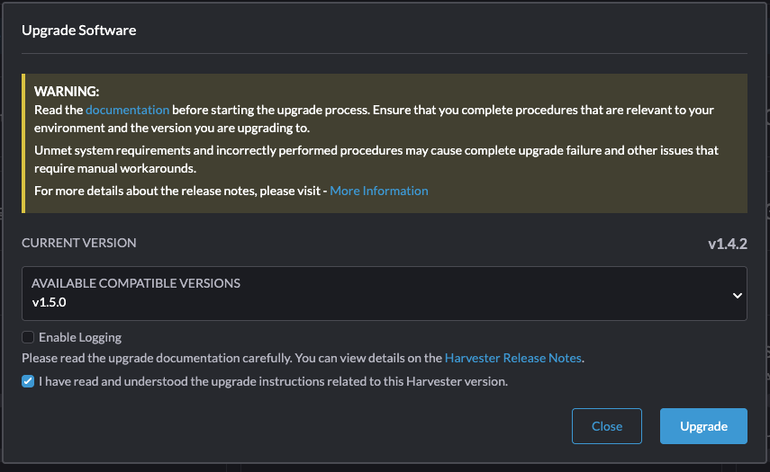
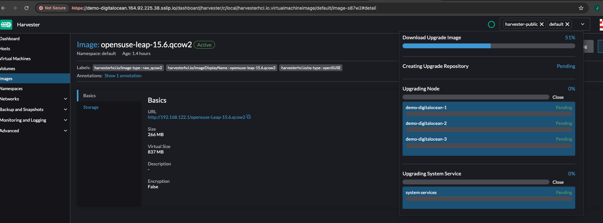
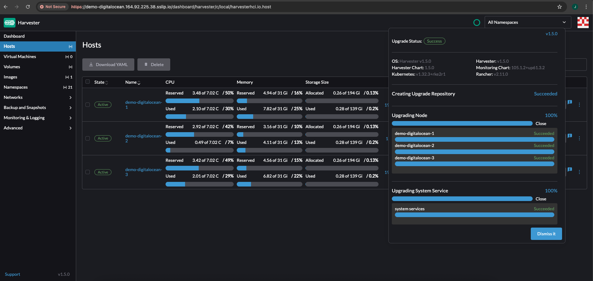

# How to perform an upgrade in a Air gapped Harvester cluster deployed by using Harvester cloud project

It is possible to restrict the internet access to the harvester nodes when deploying a Harvester cluster on the Harvester cloud project by defining variable harvester_airgapped as `true`
When a cluster is created by defining harvester_airgapped as `true` some iptables rules will be configured on the host denying all connectivity from/to Harvester nodes to/from Internet while keeping Harvester console and Command like accessible from outside of nodes network

# Pre-requisites.

First of all, we must understand the architecture behind Harvester cloud project where Harvester nodes are running as Nested Virtual Machines inside the cloud host.

```console
           |→ Data Disk 1 → Harvester Node 1
CLOUD VM --|→ Data Disk 2 → Harvester Node 2
           |→ Data Disk 3 → Harvester Node 3
```

If variable Harvester_airgapped is false the harvester nodes can access internet because the host (cloud machine) works as gateway for the nodes and this connectivity is not denied.
But when it comes to Harvester nodes without internet access we must ensure enough knowledge on how to perform specific operations like, for example, uploading an image as we won't be able to reach public repositories from Harvester.

Luckily, to be able to install and configure automatically harvester nodes, the public host where Nested Harvester nodes are running already has a NGINX server configured serving on private IP `http://192.168.122.1` that is the same subnet where Harvester nodes are located which means that we can re-use this NGINX server as our entrypoint for images.

## How to upload an image on a Air-gapped environment deployed by Harvester-cloud project

1 - Login into the public host through SSH.

```console
terraform output
first_instance_public_ip = "164.92.225.38"
harvester_url = "https://demo-digitalocean.164.92.225.38.sslip.io"
longhorn_url = "https://demo-digitalocean.164.92.225.38.sslip.io/dashboard/c/local/longhorn"
 javierlagos@MacBook-Pro-de-Javier  ~/PycharmProjects/harvester-cloud/projects/digitalocean  ssh -i demo-digitalocean-ssh_private_key.pem opensuse@164.92.225.38
Have a lot of fun...
Last login: Wed Jun  4 10:26:49 2025 from 83.36.3.177
opensuse@node-demo-digitalocean-1:~> sudo -i
node-demo-digitalocean-1:~ # 
```
2 - Download the desired image to be uploaded on Harvester on `/srv/www/harvester`

```console
node-demo-digitalocean-1:~ # curl -L -o /srv/www/harvester/opensuse-Leap-15.6.qcow2 https://download.opensuse.org/distribution/leap/15.6/appliances/openSUSE-Leap-15.6-Minimal-VM.x86_64-Cloud.qcow2
  % Total    % Received % Xferd  Average Speed   Time    Time     Time  Current
                                 Dload  Upload   Total   Spent    Left  Speed
  0     0    0     0    0     0      0      0 --:--:--  0:00:02 --:--:--     0
100  266M  100  266M    0     0  19.8M      0  0:00:13  0:00:13 --:--:-- 20.8M
node-demo-digitalocean-1:~ # ls -lhrt /srv/www/harvester/opensuse-Leap-15.6.qcow2
-rw-r--r-- 1 root root 267M Jun  4 10:37 /srv/www/harvester/opensuse-Leap-15.6.qcow2
```
3 - Create the image pointing to the NGINX server configured on IP `http://192.168.122.1`




4 - An error event will be triggered if an image is uploaded by using a public repository



# Harvester air-gapped upgrade process

1 - Login into the public host through SSH.

```console
terraform output
first_instance_public_ip = "164.92.225.38"
harvester_url = "https://demo-digitalocean.164.92.225.38.sslip.io"
longhorn_url = "https://demo-digitalocean.164.92.225.38.sslip.io/dashboard/c/local/longhorn"
 javierlagos@MacBook-Pro-de-Javier  ~/PycharmProjects/harvester-cloud/projects/digitalocean  ssh -i demo-digitalocean-ssh_private_key.pem opensuse@164.92.225.38
Have a lot of fun...
Last login: Wed Jun  4 10:26:49 2025 from 83.36.3.177
opensuse@node-demo-digitalocean-1:~> sudo -i
node-demo-digitalocean-1:~ # 
```

2 - Download ISO of the desired Harvester version on path `/srv/www/harvester/harvester.iso`. Harvester releases can be found [here](https://github.com/harvester/harvester/releases).

```console
node-demo-digitalocean-1:~ # curl -L -o /srv/www/harvester/harvester.iso https://releases.rancher.com/harvester/v1.5.0/harvester-v1.5.0-amd64.iso
  % Total    % Received % Xferd  Average Speed   Time    Time     Time  Current
                                 Dload  Upload   Total   Spent    Left  Speed
100 6891M    0 6891M    0     0  40.5M      0 --:--:--  0:02:49 --:--:-- 42.0M
```

3 - Create the following upgrade harvester object in the cluster.

```console
apiVersion: harvesterhci.io/v1beta1
kind: Version
metadata:
  name: <Harvester-version>
  namespace: harvester-system
spec:
  isoURL: http://192.168.122.1/harvester.iso 
  releaseDate: '20250425'
```

```console
 javierlagos@MacBook-Pro-de-Javier  ~/PycharmProjects/harvester-cloud/projects/digitalocean  export KUBECONFIG=demo-digitalocean_kube_config.yml 
 javierlagos@MacBook-Pro-de-Javier  ~/PycharmProjects/harvester-cloud/projects/digitalocean  cat upgrade-v1.5.0.yaml 
apiVersion: harvesterhci.io/v1beta1
kind: Version
metadata:
  name: v1.5.0
  namespace: harvester-system
spec:
  isoURL: http://192.168.122.1/harvester.iso
  releaseDate: '20250425'
 javierlagos@MacBook-Pro-de-Javier  ~/PycharmProjects/harvester-cloud/projects/digitalocean  k apply -f upgrade-v1.5.0.yaml 
version.harvesterhci.io/v1.5.0 created
```

4 - After applying Harvester upgrade object the upgrade button should appear on the Harvester dashboard console.




* Please note that whether logging is enabled while performing the upgrade we will have `ErrImagePull` on the logging pods created to collect and store upgrade logs as those pods will try to download images from DockerHub. If logging is required we must ensure those images on each Harvester node by manually uploading the image on each node.

5 - Click on `Upgrade` button and the upgrade will start as expected.





