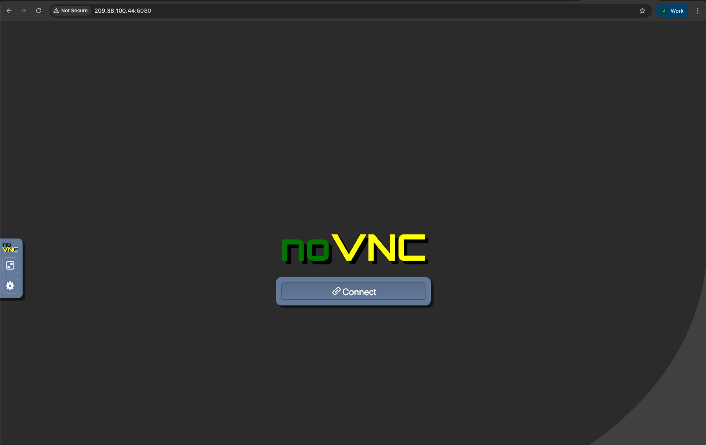
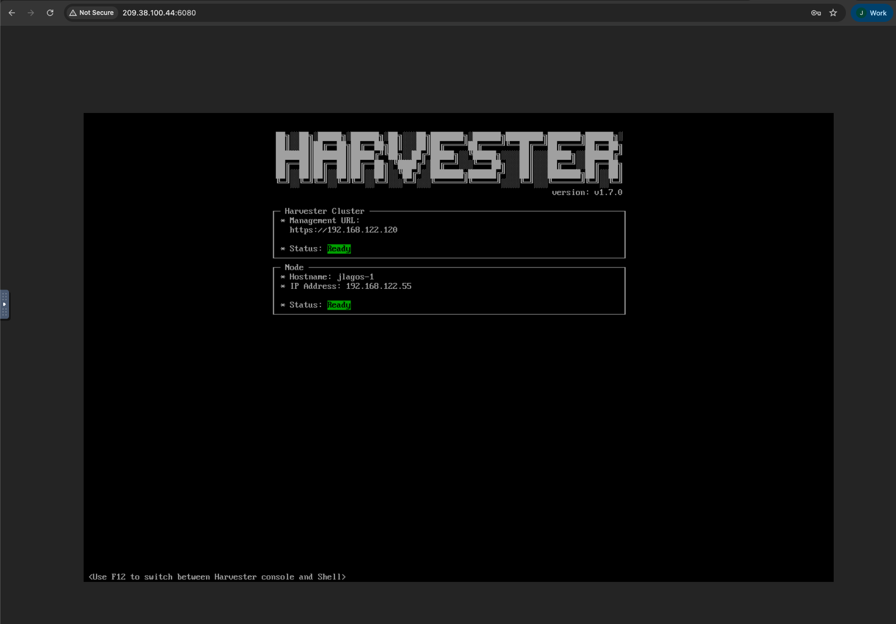

# How to access the Harvester nodes’ serial console through a browser

This documentation explains the steps to access the Harvester nodes’ serial console through a browser.

## PREREQUISITES:

* A Harvester cluster must be up and running on any cloud provider. The steps are the same for all cloud providers.
The example and steps in this documentation have been tested on a Harvester cluster deployed on DigitalOcean using the variables below.

```console
cat harvester-cloud/projects/digitalocean/terraform.tfvars

do_token = "<token>"
harvester_cluster_size = "small"
region = "ams3"
harvester_node_count = 1
prefix = "jlagos"
```

### PROCEDURE

1. Review the Terraform output and save the public IP of the cloud instance.

```console
terraform output
first_instance_public_ip = [
  "209.38.100.44",
]
harvester_url = "https://jlagos.209.38.100.44.sslip.io"
longhorn_url = "https://jlagos.209.38.100.44.sslip.io/dashboard/c/local/longhorn"
```

2. Access the cloud instance’s public IP via SSH using the SSH key files located in the same directory.

```console
ls -lrth *ssh*
-rw-------@ 1 javierlagos  staff    81B Feb 12 09:49 jlagos-ssh_public_key.pem
-rw-------@ 1 javierlagos  staff   387B Feb 12 09:49 jlagos-ssh_private_key.pem
```

```console
$ ssh -i jlagos-ssh_private_key.pem root@209.38.100.44
The authenticity of host '209.38.100.44 (209.38.100.44)' can't be established.
ED25519 key fingerprint is SHA256:e2dmUKDLK6oLkXG8gYkD+LTiXXTKm2iatyKpoisrf5g.
This key is not known by any other names.
Are you sure you want to continue connecting (yes/no/[fingerprint])? yes
Warning: Permanently added '209.38.100.44' (ED25519) to the list of known hosts.
Have a lot of fun...
node-jlagos-1:~ # 
```

3. Identify Harvester node virtual machines.

```console
node-jlagos-1:~ # virsh list
setlocale: No such file or directory
 Id   Name               State
----------------------------------
 4    harvester-node-1   running
 5    harvester-node-2   running
 6    harvester-node-3   running
```

4. Execute the Websockify proxy command to enable access to the Harvester node through a browser.
The following commands are required to access Harvester nodes via a browser.

```console
websockify --web /usr/share/novnc/ --wrap-mode=ignore 6080 localhost:5901 -> To access Node harvester-node-1
websockify --web /usr/share/novnc/ --wrap-mode=ignore 6080 localhost:5902 -> To access node harvester-node-2
websockify --web /usr/share/novnc/ --wrap-mode=ignore 6080 localhost:5903 -> To access node harvester-node-3
websockify --web /usr/share/novnc/ --wrap-mode=ignore 6080 localhost:5904 -> To access node harvester-node-4
websockify --web /usr/share/novnc/ --wrap-mode=ignore 6080 localhost:5905 -> To access node harvester node-5
```

In this example, the node harvester-node-1 will be accessible through a browser on the Internet.

```console
node-jlagos-1:~ # websockify --web /usr/share/novnc/ --wrap-mode=ignore 6080 localhost:5901
WebSocket server settings:
  - Listen on :6080
  - Flash security policy server
  - Web server. Web root: /usr/share/novnc
  - No SSL/TLS support (no cert file)
  - proxying from :6080 to localhost:5901
```

5. Access the public IP via a browser on port 6080.



Once connected, you must enter the password. The password is `yourpass`.


