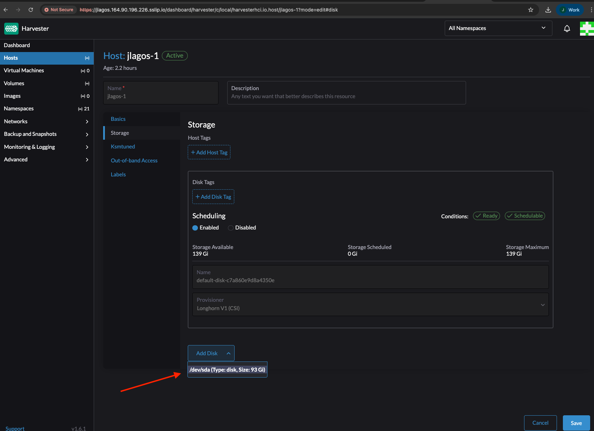
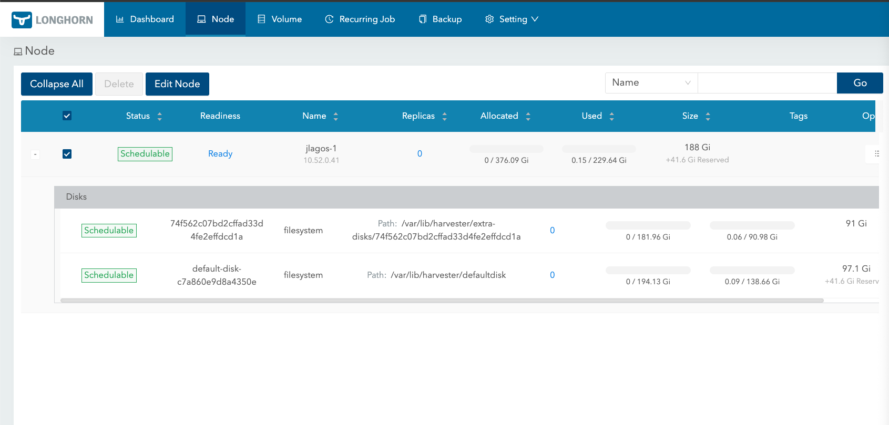

# How to Configure an iSCSI Disk in a Harvester Cluster

This documentation explains the use case for exposing an iSCSI disk and mounting it in a Harvester cluster deployed using the `harvester-cloud` project.

All scenarios and tests are performed on a Harvester cluster deployed on DigitalOcean. With minor changes, the same procedure can be applied to Harvester clusters deployed on other cloud providers, as only the creation of the additional disk differs between providers.

## PREREQUISITES:

* A Harvester cluster must be up and running on any cloud provider.
The examples in this guide were tested on a Harvester cluster deployed on DigitalOcean using the variables below.

```console
cat harvester-cloud/projects/digitalocean/terraform.tfvars

do_token = "<token>"
harvester_cluster_size = "small"
region = "ams3"
harvester_node_count = 1
prefix = "jlagos"
```

* An additional disk provisioned by the cloud provider and attached to the instance running Harvester.
On DigitalOcean, the disk can be created and attached using doctl or via the DigitalOcean control panel.
Refer to the [official documentation](https://docs.digitalocean.com/reference/doctl/how-to/install/) for more details.

```console
1 - Create DigitalOcean Volume by selecting the same region where the cluster has been deployed
doctl compute volume create test-iscsi --region ams3 --size 100G

2 - Identify Droplet ID
doctl compute droplet get node-<prefix>-1 

3 - Attach volume to droplet
doctl compute volume-action attach <volume-id> <droplet-id>

4 - We can confirm the volume has been attached as a disk correctly inside the droplet

node-jlagos-1:~ # fdisk -l /dev/sdb
Disk /dev/sdb: 93 GiB, 99857989632 bytes, 195035136 sectors
Disk model: Volume          
Units: sectors of 1 * 512 = 512 bytes
Sector size (logical/physical): 512 bytes / 512 bytes
I/O size (minimum/optimal): 512 bytes / 512 bytes
```

* Optionally, the iSCSI network can be separated from the Harvester management subnet (192.168.122.0/24) by adding a new network interface to the Harvester nodes using the [network-creation](https://github.com/rancher/harvester-cloud/tree/main/projects/harvester-ops/network-creation) project.

In this document, a new network interface will be created for the Harvester nodes.
The following variables are used to execute the network-creation Terraform script.

```console
cat harvester-cloud/projects/harvester-ops/network-creation/terraform.tfvars

harvester_url             = "https://<prefix>.142.93.232.227.sslip.io"
kubeconfig_file_path      = "../../digitalocean/"
kubeconfig_file_name      = "<prefix>_kube_config.yml"
private_ssh_key_file_name = "<prefix>-ssh_private_key.pem"
private_ssh_key_file_path = "../../digitalocean/"
ssh_username              = "opensuse"
cluster_network_count = 1 # ens7 interface will be added to Local Harvester node which is connected to 192.168.123.0/24 subnet
```

### Expose iSCSI disk on the cloud instance.

1. Identifying the additional disk mounted on the cloud instance.

```console
1 - SSH into the node. terraform output to get the public IP of the cloud instance where Harvester nodes are running.

terraform output
first_instance_public_ip = [
  "<public-ip>",
]
harvester_url = "https://<prefix>.<public-ip>.sslip.io"
longhorn_url = "https://<prefix>.<public-ip>.sslip.io/dashboard/c/local/longhorn"

2 - ssh -i <prefix>-ssh_private_key.pem root@<public-ip>

3 - lsblk -fp & fdisk -l to identify the additional disk

lsblk -fp
NAME        FSTYPE   FSVER            LABEL    UUID                                 FSAVAIL FSUSE% MOUNTPOINTS
/dev/loop0  squashfs 4.0                                                                  0   100% /run/overlay/squashfs_container
/dev/loop1  ext4     1.0                       8e5c72bd-9601-49fe-b5a1-895fc705b3db  354.7M    73% /run/overlay/rootfsbase
/dev/sda                                                                                           
`-/dev/sda1 ext4     1.0                       320a894e-f758-49e6-a9d2-325a8259de20    278G    14% /mnt/datadisk1
/dev/sdb                                                                                           
/dev/vda    iso9660  Joliet Extension CDROM    2026-01-23-11-37-07-00                              
|-/dev/vda1 iso9660  Joliet Extension CDROM    2026-01-23-11-37-07-00                     0   100% /run/overlay/live
|-/dev/vda2 vfat     FAT16            BOOT     C55D-0D5B                                           
`-/dev/vda3 ext4     1.0              cow      90690b59-676b-455a-bfb6-fc3d761ead60  215.3G     3% /run/overlay/overlayfs
/dev/vdb    iso9660                   config-2 2026-01-29-11-23-25-00    

node-jlagos-1:~ # fdisk -l
Disk /dev/loop0: 330.13 MiB, 346161152 bytes, 676096 sectors
Units: sectors of 1 * 512 = 512 bytes
Sector size (logical/physical): 512 bytes / 512 bytes
I/O size (minimum/optimal): 512 bytes / 512 bytes


Disk /dev/loop1: 1.72 GiB, 1848639488 bytes, 3610624 sectors
Units: sectors of 1 * 512 = 512 bytes
Sector size (logical/physical): 512 bytes / 512 bytes
I/O size (minimum/optimal): 512 bytes / 512 bytes


Disk /dev/vda: 240 GiB, 257698037760 bytes, 503316480 sectors
Units: sectors of 1 * 512 = 512 bytes
Sector size (logical/physical): 512 bytes / 512 bytes
I/O size (minimum/optimal): 512 bytes / 512 bytes
Disklabel type: gpt
Disk identifier: BDF98DB5-8AA9-49CA-BD95-4EB089F88FCE

Device      Start       End   Sectors   Size Type
/dev/vda1      64    865483    865420 422.6M Microsoft basic data
/dev/vda2  865484    906443     40960    20M EFI System
/dev/vda3  907264 503314431 502407168 239.6G Linux filesystem


Disk /dev/vdb: 450 KiB, 460800 bytes, 900 sectors
Units: sectors of 1 * 512 = 512 bytes
Sector size (logical/physical): 512 bytes / 512 bytes
I/O size (minimum/optimal): 512 bytes / 512 bytes


Disk /dev/sda: 350 GiB, 375809638400 bytes, 734003200 sectors
Disk model: Volume          
Units: sectors of 1 * 512 = 512 bytes
Sector size (logical/physical): 512 bytes / 512 bytes
I/O size (minimum/optimal): 512 bytes / 512 bytes
Disklabel type: gpt
Disk identifier: 4B555C14-ADC0-4DEB-A4C9-8E69FC0AA1DA

Device     Start       End   Sectors  Size Type
/dev/sda1   2048 734001151 733999104  350G Linux filesystem


Disk /dev/sdb: 93 GiB, 99857989632 bytes, 195035136 sectors
Disk model: Volume          
Units: sectors of 1 * 512 = 512 bytes
Sector size (logical/physical): 512 bytes / 512 bytes
I/O size (minimum/optimal): 512 bytes / 512 bytes

/dev/sdb is the new additional disk added
```

2. Installing pip and targetcli on the cloud machine.

```console
1 - zypper in python3-pip
2 - pip3 install targetcli-fb configshell_fb rtslib_fb 
3 - mkdir /etc/target
```

3. Modify and execute the following script on the cloud machine.

```console
DISK="/dev/sdb"
IQN="iqn.2026-01.com.test:disk1"
IP_PORTAL="192.168.123.1"
PORT=3260
BACKSTORE_NAME="disk1"
HARVESTER_IQN="" # To obtain this info you must execute cat /etc/iscsi/initiatorname.iscsi within Harvester node 

echo "[INFO] Configuring backstore for $DISK..."
sudo targetcli /backstores/block create name=$BACKSTORE_NAME dev=$DISK

echo "[INFO] creating target IQN $IQN..."
sudo targetcli /iscsi create $IQN

echo "[INFO] creating LUN 0 poiting to backstore..."
sudo targetcli /iscsi/$IQN/tpg1/luns create /backstores/block/$BACKSTORE_NAME

echo "[INFO] configuring portal only on $IP_PORTAL:$PORT..."
# first removing portal by default (0.0.0.0:3260)
sudo targetcli /iscsi/$IQN/tpg1/portals delete 0.0.0.0 $PORT
# creating portal with the desired IP
sudo targetcli /iscsi/$IQN/tpg1/portals create $IP_PORTAL $PORT

echo "[INFO] Creating access point by using our ISCSI initiator name from Harvester node"
sudo targetcli /iscsi/$IQN/tpg1/acls create $HARVESTER_IQN

echo "[INFO] saving config..."
sudo targetcli saveconfig
```

```console
node-jlagos-1:~ # bash iscsi.sh
[INFO] Configuring backstore for /dev/sdb...
Created block storage object disk1 using /dev/sdb.
[INFO] creating target IQN iqn.2026-01.com.test:disk1...
Created target iqn.2026-01.com.test:disk1.
Created TPG 1.
Global pref auto_add_default_portal=true
Created default portal listening on all IPs (0.0.0.0), port 3260.
[INFO] creating LUN 0 poiting to backstore...
Created LUN 0.
[INFO] configuring portal only on 192.168.123.1:3260...
Deleted network portal 0.0.0.0:3260
Using default IP port 3260
Created network portal 192.168.123.1:3260.
[INFO] Creating access point by using our ISCSI initiator name from Harvester node
Created Node ACL for iqn.1996-04.de.suse:01:d962b0a3d9f4
Created mapped LUN 0.
[INFO] saving config...
Last 10 configs saved in /etc/target/backup/.
Configuration saved to /etc/target/saveconfig.json

node-jlagos-1:~ # targetcli ls
o- / ......................................................................................................................... [...]
  o- backstores .............................................................................................................. [...]
  | o- block .................................................................................................. [Storage Objects: 1]
  | | o- disk1 ........................................................................... [/dev/sdb (93.0GiB) write-thru activated]
  | |   o- alua ................................................................................................... [ALUA Groups: 1]
  | |     o- default_tg_pt_gp ....................................................................... [ALUA state: Active/optimized]
  | o- fileio ................................................................................................. [Storage Objects: 0]
  | o- pscsi .................................................................................................. [Storage Objects: 0]
  | o- ramdisk ................................................................................................ [Storage Objects: 0]
  o- iscsi ............................................................................................................ [Targets: 1]
  | o- iqn.2026-01.com.test:disk1 ........................................................................................ [TPGs: 1]
  |   o- tpg1 ............................................................................................... [no-gen-acls, no-auth]
  |     o- acls .......................................................................................................... [ACLs: 1]
  |     | o- iqn.1996-04.de.suse:01:d962b0a3d9f4 .................................................................. [Mapped LUNs: 1]
  |     |   o- mapped_lun0 ................................................................................. [lun0 block/disk1 (rw)]
  |     o- luns .......................................................................................................... [LUNs: 1]
  |     | o- lun0 ...................................................................... [block/disk1 (/dev/sdb) (default_tg_pt_gp)]
  |     o- portals .................................................................................................... [Portals: 1]
  |       o- 192.168.123.1:3260 ............................................................................................... [OK]
  o- loopback ......................................................................................................... [Targets: 0]
  o- vhost ............................................................................................................ [Targets: 0]
  o- xen-pvscsi ....................................................................................................... [Targets: 0]
```

### Mount iSCSI disk on Harvester node

1. Access Harvester node through SSH and add an IP from 192.168.123.0/24 subnet to ens7 interface

```console
1 - ssh rancher@192.168.122.120 # Password can be obtained from join/Create yaml file located on the cloud directory (DigitalOcean,Google-cloud & Azure)

2 - ip link show ens7
ens7: <BROADCAST,MULTICAST,UP,LOWER_UP> mtu 1500 qdisc pfifo_fast state UP mode DEFAULT group default qlen 1000
    link/ether 52:54:00:cf:fe:0d brd ff:ff:ff:ff:ff:ff
    altname enp0s7
3 - ip addr add 192.168.123.36/24 dev ens7
```

2. Apply iscsiadm commands

```console
1 - iscsiadm -m discovery -t sendtargets -p 192.168.123.1
2 - iscsiadm -m node -T iqn.2026-01.com.test:disk1 -p 192.168.123.1 -l
```

3. Check on Harvester node the new disk

```console
fdisk -l /dev/sda
Disk /dev/sda: 93 GiB, 99857989632 bytes, 195035136 sectors
Disk model: disk1           
Units: sectors of 1 * 512 = 512 bytes
Sector size (logical/physical): 512 bytes / 512 bytes
I/O size (minimum/optimal): 512 bytes / 33550336 bytes
```

4. Check on Harvester UI/CLI that the new disk can be added.

```console
kubectl get blockdevices -A
NAMESPACE         NAME                               TYPE   DEVPATH    MOUNTPOINT   NODENAME   PROVISIONPHASE   AGE
longhorn-system   74f562c07bd2cffad33d4fe2effdcd1a   disk   /dev/sda                jlagos-1   Unprovisioned    77s
```



5. Add the disk. It is also possible to confirm new disk on Longhorn UI.



6. The previous configuration is not persistent which means that it will be removed after a node reboot. In case the configuration needs to be persistent after a reboot the following command must be executed.

```console
kubectl apply -f - <<EOF
apiVersion: node.harvesterhci.io/v1beta1
kind: CloudInit
metadata:
  name: iscsi-storage
spec:
  contents: |
    stages:
      initramfs:
        - name: "Configure ens7 for iSCSI network"
          files:
            - path: /etc/sysconfig/network/ifcfg-ens7
              permissions: 384
              owner: 0
              group: 0
              content: |
                STARTMODE='onboot'
                BOOTPROTO='static'
                IPADDR=192.168.123.36
                NETMASK=255.255.255.0
                DHCLIENT_SET_DEFAULT_ROUTE='no'
                LINK_REQUIRED='no'    
      network:
        - name: "Connect to iSCSI storage"
          systemctl:
            enable:
              - iscsid
            start:
              - iscsid
          commands:
            - iscsiadm -m discovery -t sendtargets -p 192.168.123.1
            - iscsiadm -m node -T iqn.2026-01.com.test:disk1 -p 192.168.123.1 -l
  filename: 91-iscsi-storage.yaml
  matchSelector: {}
EOF
```
